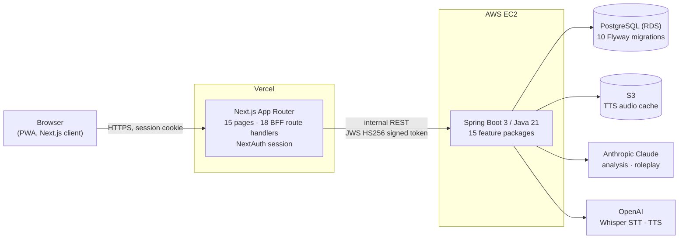

# NextMadi

[](https://github.com/yyj9529/nextmadi/actions/workflows/lint-test.yml)

AI English coaching for Korean immigrants in the US — built around one conviction: that
responding with confidence in a real conversation matters more than producing
textbook-perfect English.

**Stack:** Next.js (App Router) · Spring Boot 3 / Java 21 · PostgreSQL · AWS S3 ·
NextAuth · Anthropic Claude · OpenAI Whisper & TTS

---

## Architecture



The browser never talks to Spring Boot or to any model provider directly. Next.js route
handlers act as a BFF: they hold the NextAuth session, mint a short-lived signed token for
the internal hop, and are the only tier that knows the backend's address
([ADR-010](docs/decisions/010-bff-auth-handoff.md)).

## Status

**In active development.** The v1 product loop is implemented end-to-end across the
frontend, backend, and AI pipeline. It runs locally against PostgreSQL without any
provider API keys (mock AI clients + filesystem audio storage). Not yet publicly
deployed — v1 launch is targeted for week 12 of a 12-week cycle.

| Area | State |
|---|---|
| Frontend | 15 pages + 18 BFF API routes (Next.js App Router, PWA-installable) |
| Backend | Spring Boot service, 15 feature packages, 10 Flyway migrations |
| Auth | NextAuth — Google, Kakao, and email magic-link over Amazon SES |
| AI pipeline | Claude analysis + roleplay, OpenAI STT/TTS, schema validation, per-call cost logging |
| Eval | LLM-as-judge harness, 82 cases, N=3 trials. Wired as a CI regression gate; the paid run is not enabled in CI yet (see Engineering notes) |
| Tests | 778 — 445 JUnit across 73 suites, 333 `bun test` across 48 files. 17 JUnit suites (116 tests) run against Testcontainers PostgreSQL: they skip without a Docker daemon and run in CI |
| CI | `lint-test.yml` (typecheck, lint, unit tests) · `eval.yml` (prompt regression gate) |

## What the product does

1. **Describe a situation in Korean** — "친구가 약속에 늦었는데 화내지 않고 표현하고 싶어요."
   (voice or text; voice goes through Whisper).
2. **Claude returns 3 English variants** — each with tone, IPA, a Korean phonetic guide,
   and a cultural tip.
3. **Save to the library** — expressions accumulate as a personal bookshelf.
4. **Practice via roleplay** — a chosen AI coach (Mia / David / Sarah) runs a 3–10 turn
   conversation that forces the saved expression into use.
5. **Review via active recall** — the Korean situation appears first; the user attempts
   the English from memory; the rating schedules the next review.

Closed loop: save → practice → review. No streaks, no absence-based decay — user research
found that streak-shaming works against this segment's dominant emotional pattern
([ADR-002](docs/decisions/002-cumulative-bookshelf-over-streak.md)).

## Engineering notes

The parts most likely to be interesting to another engineer.

### The AI layer is treated as production infrastructure, not as an API call

- **Prompts are versioned artifacts** — `prompts/{feature}/v{N}.md`, referenced by
  `prompt_version` on every request, so output changes are attributable to a diff.
- **Evaluation is built to gate prompt changes in CI.** `eval/s07-analysis/` runs an
  LLM-as-judge over 82 cases with a 4-dimension rubric and N=3 trials per case, and the
  workflow fails a PR whose prompt change regresses the aggregate score
  ([ADR-009](docs/decisions/009-eval-trial-repetition.md),
  [EVAL_PLAN.md](docs/EVAL_PLAN.md)). The deterministic checks run on every relevant PR.
  The paid run waits on an API-key secret that is deliberately not configured yet — one
  full run costs about $16.50 (measured locally, 2026-09-09) — so until then the job
  fails loudly instead of reporting a pass for a run that never happened.
  *Trade-off:* three trials per case triples eval spend and wall-clock. Accepted because a
  single trial cannot distinguish a real regression from model nondeterminism, which makes
  the gate worse than no gate — it produces confident false alarms.
- **Structured output is enforced, not hoped for.** `JsonSchemaValidator` validates every
  model response server-side, with a single constrained retry before failing.
- **Cost and failure are observable per call.** `AiRequestLogger` + `AiCostCalculator`
  write one `ai_request_logs` row per *attempt* — not per call — so retries stay visible
  ([ADR-011](docs/decisions/011-per-attempt-ai-request-logging.md)).
  *Trade-off:* a successful two-attempt call now writes two rows, so every query counting
  "requests" has to filter. Accepted because the alternative hides the cost of retries
  precisely when retries are spiking.
- **Model routing is a config surface.** `FeatureRouting` maps each feature to a model
  tier, so routing is re-evaluated with data rather than rewritten in code.
- **AI is testable offline.** `MockAnthropicClient` / `MockOpenAiTtsClient` /
  `MockOpenAiTranscriptionClient` let the whole stack run and be tested without keys or
  spend.

### The internal auth boundary is signed, and the algorithm is fixed server-side

Next.js route handlers sign a short-lived JWS for each call to Spring Boot.
[`InternalAuthVerifier`](backend/src/main/java/com/phraselog/auth/service/InternalAuthVerifier.java)
pins the algorithm to HS256 and **rejects the token's own `alg` header rather than trusting
it** — `none` and any asymmetric algorithm are refused outright, which is what closes the
algorithm-confusion class of attack. Secrets are accepted as a list so two can overlap
during rotation.

*Rejected alternative:* forwarding the NextAuth session cookie straight through to Spring.
Simpler, but it makes the backend's trust boundary the browser's, and it gives the backend
no way to distinguish "a user asked for this" from "something replayed a cookie."

### Retried roleplay requests are deduplicated end to end

Starting a practice session, submitting a roleplay turn, and saving an expression from a
roleplay result each carry an idempotency key generated in the browser and kept across
retries. The BFF forwards it unchanged, so a double-click or a retry after a dropped
response reuses the first result instead of creating a second session, turn, or row.

*Known gap:* analysis submission and saving an expression from an analysis result do not
have this yet. There the BFF mints a fresh key per request, so the backend cannot
recognize a browser-side double submit as one operation. For anonymous users the per-IP
daily quota bounds how often that can happen.

Roleplay turn submission needs more than that, because two concurrent turns would both read
the same "next turn number" and both pass the planned-turn limit. That path additionally
takes a row lock on the session
([`JdbcPracticeTurnRepository`](backend/src/main/java/com/phraselog/practice/repository/JdbcPracticeTurnRepository.java) —
`SELECT ... FOR UPDATE`) and appends the user/coach turn pair inside that transaction.

*Trade-off:* the lock serializes turns within a single session, capping that session's
throughput. Irrelevant here — a session is one human typing — and the alternative
(optimistic retry on a unique constraint) would have burned a Claude call per losing retry.

### Library paging is keyset, not offset

[`ExpressionRepository.list`](backend/src/main/java/com/phraselog/expression/repository/ExpressionRepository.java)
pages on a `(created_at DESC, id DESC)` cursor pair rather than an offset, so page cost stays
flat as the bookshelf grows and rows can't be skipped or duplicated when a save lands
mid-scroll.

*Trade-off:* no jumping to an arbitrary page number. The bookshelf is an infinite scroll,
so that affordance was never on the screen.

**Also worth a look:** an account-deletion grace period rather than an immediate hard
delete; per-IP daily quotas on anonymous analysis and transcription, kept in separate
budgets so a bad transcription cannot burn an analysis attempt.

## Running it locally

Prerequisites: Bun, Java 21, and a running PostgreSQL.

**Backend.** Create a database, copy the local profile example, and adjust the connection
settings in the copy. The copy is git-ignored.

```bash
createdb phraselog
cp backend/src/main/resources/application-local.example.yml backend/src/main/resources/application-local.yml
cd backend && ./gradlew bootRun --args='--spring.profiles.active=local'
```

The `local` profile turns on the mock AI clients and filesystem audio storage, and Flyway
creates the schema on first start — no provider keys, no spend.

**Frontend.**

```bash
bun install
cp .env.example .env
bun run dev
```

`INTERNAL_AUTH_SECRET` must be at least 32 bytes and match the backend's secret. The
example already holds the backend's development default, so the two match as copied.
Fill in `AUTH_SECRET` before starting. The anonymous `/try` flow needs no sign-in; Google
and Kakao sign-in need your own OAuth credentials.

Run the frontend on port 3000 — OAuth callbacks are configured for `localhost:3000`, and
any other port fails with `redirect_uri_mismatch`.

Quality gates:

```bash
bun run typecheck && bun run lint && bun run test
```

```bash
cd backend && ./gradlew spotlessCheck test build
```

## Repository map

| Path | Contents |
|---|---|
| `src/` | Next.js app — pages, BFF route handlers, client libraries |
| `backend/` | Spring Boot service — controllers, services, repositories, migrations |
| `prompts/` | Versioned LLM prompts (`{feature}/v{N}.md`) |
| `eval/` | S07 analysis eval harness, case set, judge rubric |
| `docs/` | PRD, architecture, data model, AI pipeline, API contract, screen specs |
| `docs/decisions/` | Architecture Decision Records — start at [`INDEX.md`](docs/decisions/INDEX.md) |
| `docs/solutions/` | Recurring-mistake ledger and the automated guards added for each |

## On the documentation volume

This repository carries an unusually large specification set for a solo project. The
reason is operational: development runs with AI coding agents, and an agent opening a
session has no memory of last week's reasoning. Written specs, ADRs, and explicit quality
gates are what make an agent's output reviewable instead of merely plausible-looking.
`CLAUDE.md` is the working agreement the tooling loads; `docs/harness.md` and
`docs/quality-gates.md` define how a change gets from plan to merge.

`docs/solutions/` is the other half of that: every mistake that recurred got a note, and
by the third recurrence an automated guard — a hook, a test, or a CI check — rather than
an intention to be more careful.

## A note on the name

The product was called PhraseLog during planning and was renamed to NextMadi before
launch. Internal identifiers still carry the old name — the Java package `com.phraselog`,
the `PHRASELOG_*` environment variables, the S3 bucket, and the session cookie. Renaming
them would touch roughly 280 files and require recreating deployed AWS resources, for no
behavioral gain, so they were left alone.

## Author

WooJu Lee (이우주)
garethgates88@gmail.com · [github.com/yyj9529](https://github.com/yyj9529)
